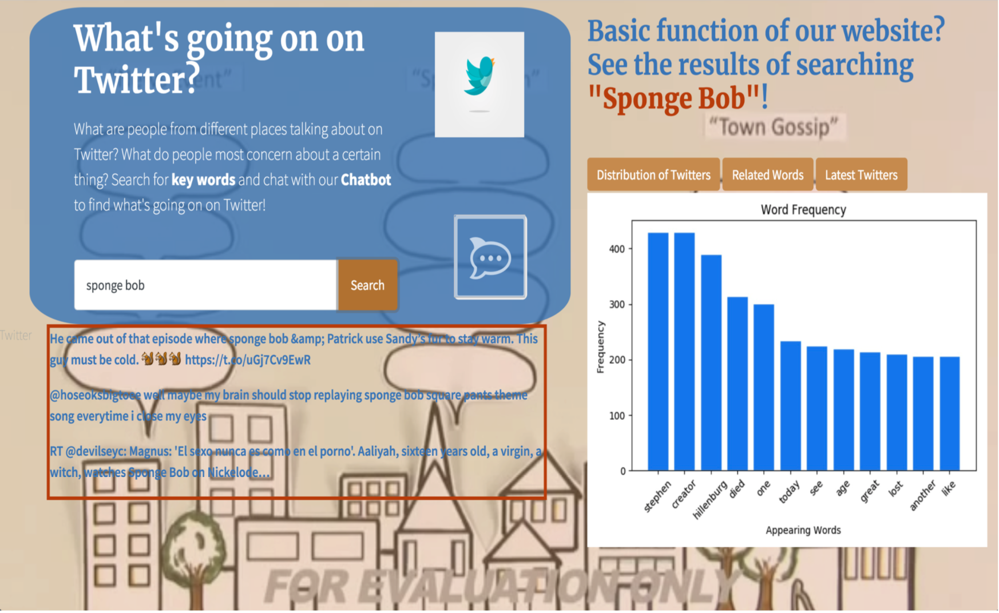

### Twitter Analysis: A small assignment for the course Cloud Computing.

> In this tiny project, we build a small website hosted on AWS to analyze the tweets from Twitter. The data is gathered from Twitter website using Tweepy, then processed with NLTK. A chatbot is built using Amazon Lambda as a serverless engine, then embedded into the website using Amazon Lex API.

